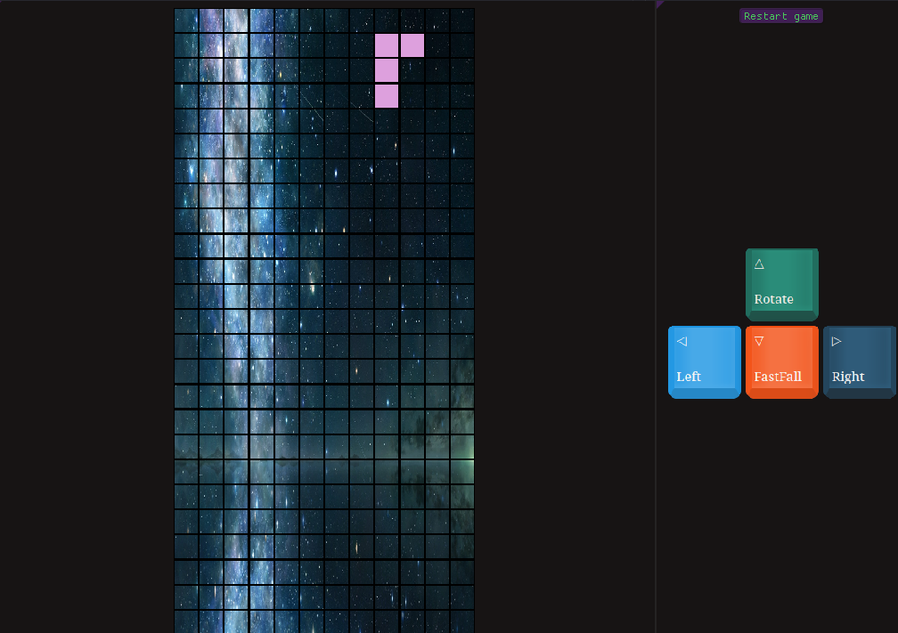
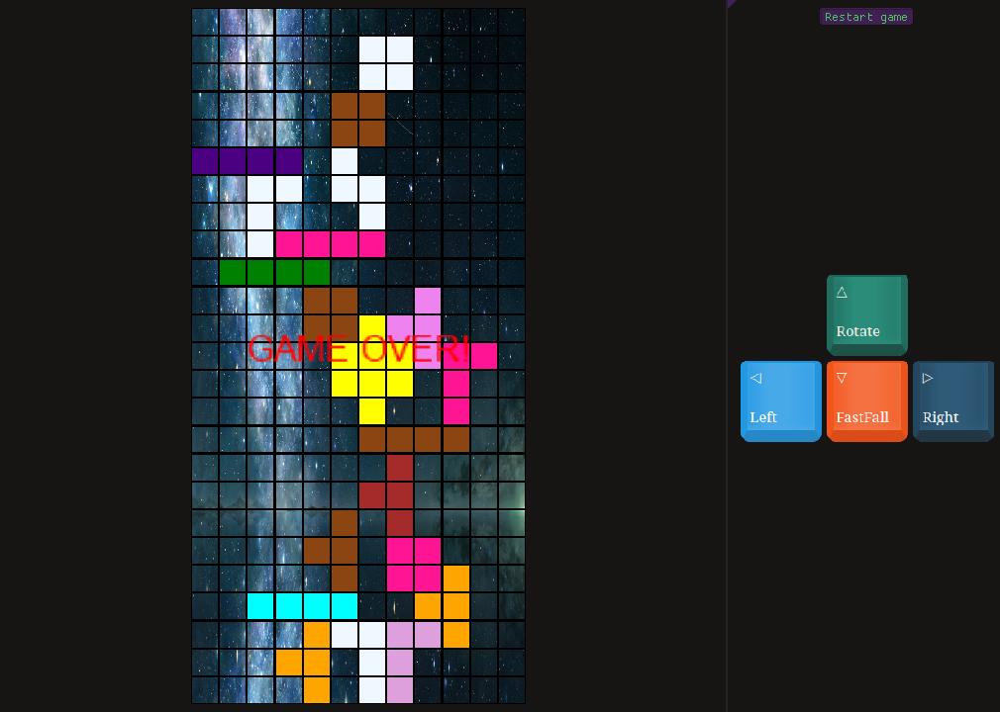

# Tetris Game

 Download from the binary from [releases](https://github.com/Storm-77/Tetris/releases) section

# Build instructions
### You need to have dotnet 6.0 sdk installed to build this application
To build release version
```
dotnet restore
```

```
dotnet publish --configuration Release --output ./build
```

You can perform a debug build too by running

```
dotnet build
```






